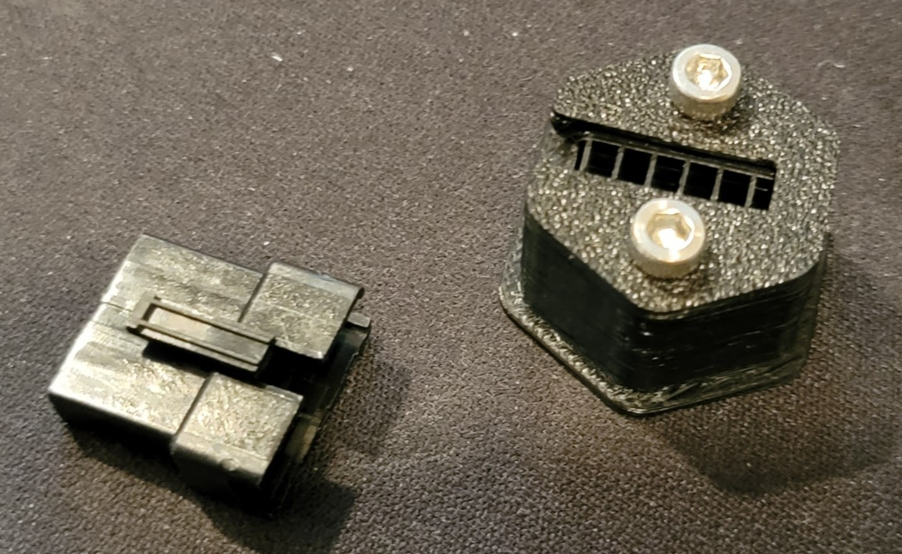

# Voron JST SM Insert
Skirt insert for JST SM Connector

Instructions:

Remove clips on each side of male connector
Insert into the back of the mount
Close it off with 2 m3x6 or m3x8 mm screws
Push insert into a hole in the skirt

